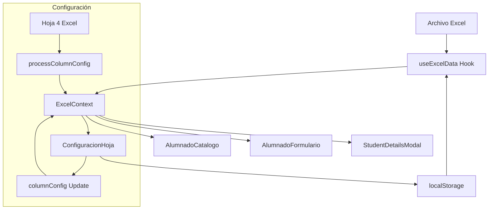

# Análisis del Sistema de Concentrador de Calificaciones

## Resumen del Sistema

El **Concentrador de Calificaciones para Docentes** es una aplicación React + TypeScript que utiliza archivos Excel como base de datos para gestionar calificaciones estudiantiles. El sistema permite visualizar, editar y configurar datos de estudiantes organizados en períodos de tiempo representados por colores.

## Estructura de Datos del Excel

### Columnas Principales

El archivo Excel contiene las siguientes columnas organizadas en secciones:

#### Sección de Información Personal (Azul - Visible en catálogo)
- `ID` - Identificador único del estudiante
- `NOMBRE` - Nombre del estudiante  
- `APELLIDO` - Apellido del estudiante
- `CORREO.ELECTONICO ` - Correo electrónico (con espacio al final)

#### Sección de Actividades por Períodos (Coloreadas)

**Período Negro (7 columnas):**
- `PRESEN-ENCUADRE-27-AGO-21`
- `PROPIEDADES-NUMEROS-REALES-03-SEP-21`
- `JERARQUIA-OPERACIONES-MCM-MCD-10-SEP-21`
- `PROPORCIONALIDAD-17-SEP-21`
- `VARIACION.DIRECTA-INVERSA-24-SEP-21`
- `SUCESION-SERIES-01-OCT-21`
- `1ER.PARCIAL-30-SEP-21`

**Período Verde (8 columnas):**
- `SUCESIONES-SERIES-ARITMETICAS-08-OCT-21`
- `SUCESIONES-SERIES-GEOMETRICAS-15-OCT-21`
- `MEDIDAS.TENDENCIA.CENTRAL-22-OCT-21`
- `MEDIDAS.DISPERSION-29-OCT-21`
- `CONCEPTOS.BASICOS.PROBABILIDAD-05-NOV-21`
- `CONTEXTO ALGEBRAICO-12-NOV-21`
- `SUMA-RESTA-POLINOMIOS-19-NOV-21`
- `2DO.PARCIAL-19-NOV-21`

**Período Morado (7 columnas):**
- `MULTIPLICACION.POLINOMIOA-26-NOV-21`
- `DIVISION.POLINOMIOS-03-DIC-21`
- `ECUACION.LINEAL.UNA-VARIABLE-10-DIC-21`
- `ECUACION.LINEAL.DOS-VARIABLES-17-DIC-21`
- `ECUACION.LINEAL.TRES-VARIABLES-07-ENE-22`
- `CLASIFICACION.METODOS.ECUACIONES-CUADRATICAS-14-ENE-22`
- `EXAMEN.FINAL-19-ENE-22`

#### Sección de Resultados Finales
- `SUMA.PORCENTAJE.ACTIVIDADES` - Suma de porcentajes
- `TOTAL.ALCANZADO.DE.PORCENTAJE.ACTIVIDADES` - Total alcanzado
- `PARTICIPACIÓN` - Calificación de participación (editable)
- `TOTAL.ALCANZADO` - Total general alcanzado
- `CALIFICACION` - Calificación final

## Configuración del Sistema

### ColumnConfig Interface

El sistema utiliza la interfaz `ColumnConfig` para manejar la configuración dinámica:

```typescript
export interface ColumnConfig {
    black: {
        numColumns: number;      // Número de columnas del período
        rangeColumns: string;    // Rango en formato Excel (ej: "F1:L1")
        color: string;          // Color en formato hexadecimal
    };
    green: { /* mismo formato */ };
    purple: { /* mismo formato */ };
}
```

### Configuración por Defecto

```typescript
{
    black: { numColumns: 7, rangeColumns: 'F1:L1', color: '#000000ff' },
    green: { numColumns: 8, rangeColumns: 'M1:T1', color: '#92d050ff' },
    purple: { numColumns: 7, rangeColumns: 'U1:AA1', color: '#7030a0ff' }
}
```

## Análisis de Archivos Clave

### 1. `useExcelData.tsx`

**Funcionalidades principales:**
- Carga datos desde archivos Excel usando la librería `xlsx`
- Procesa configuración desde la cuarta hoja del Excel
- Maneja localStorage para persistencia
- Decodifica caracteres especiales (acentos)

**Función `processColumnConfig`:**
```typescript
const processColumnConfig = (configData: (string | number)[][]): ColumnConfig => {
    // Procesa datos del formato: [PERIODO, COLOR_NAME, HEX_COLOR, RANGE, NUM_COLUMNS]
    // Ejemplo: ['PRIMER.PERIODO', 'negro', '#000000ff', 'F1:L1', '7']
}
```

**Características técnicas:**
- Utiliza `Buffer.from()` para decodificación de caracteres
- Implementa caché en localStorage con clave `excelData`
- Maneja errores de parseo y carga
- Preserva configuración personalizada del usuario

### 2. `AlumnadoCatalogo.tsx`

**Características:**
- Muestra tabla principal con columnas seleccionadas
- Implementa `formatColumnHeader()` para presentación amigable de nombres
- Botones de acción por estudiante (ver detalles por color)
- Funcionalidad de copia de correos electrónicos

**Función de formateo:**
```typescript
const formatColumnHeader = (columnName: string): string => {
    // Maneja casos especiales y fechas en formato "texto-dd-mmm-yy"
    // Convierte puntos a espacios y capitaliza palabras
}
```

**Columnas mostradas:**
- Información básica: ID, NOMBRE, APELLIDO, CORREO.ELECTONICO
- Resultados finales: PARTICIPACIÓN, TOTAL.ALCANZADO, CALIFICACION
- Acciones dinámicas por período de color

### 3. `StudentDetailsModal.tsx`

**Funcionalidades:**
- Modal especializado por color (black/green/purple)
- Muestra fechas, puntos y resultados en formato tabular
- Calcula rangos de columnas dinámicamente usando `getColumnRange()`
- Formatea fechas desde números Excel a DD/MM/YYYY

**Función `getColumnRange`:**
```typescript
const getColumnRange = (group: 'black' | 'green' | 'purple') => {
    const config = columnConfig[group];
    const startCol = config.rangeColumns.split(':')[0].replace(/\d+/g, '');
    const endCol = config.rangeColumns.split(':')[1].replace(/\d+/g, '');
    // Calcula rango de columnas alfabéticamente
}
```

### 4. `AlumnadoFormulario.tsx`

**Características:**
- Formulario de edición completo por estudiante
- Secciones organizadas por colores con títulos dinámicos
- Campos editables vs solo lectura (especial: PARTICIPACIÓN siempre editable)
- Tooltips con fechas y puntos máximos

**Función `getColumnsByGroup`:**
```typescript
const getColumnsByGroup = (group: 'black' | 'green' | 'purple', myFormData: ExcelData) => {
    // Calcula rangos dinámicamente basado en columnConfig
    // Filtra columnas excluyendo secciones fijas
}
```

**Campos especiales:**
- `PARTICIPACIÓN` - Siempre editable, independiente de las actividades
- Campos calculados - Solo lectura (SUMA.PORCENTAJE.ACTIVIDADES, TOTAL.ALCANZADO, etc.)

## Estado Actual de `ConfiguracionHoja.tsx`

### Funcionalidades Existentes

1. **Configuración básica por período:**
   - Edición de número de columnas
   - Modificación de rangos Excel
   - Cambio de colores hexadecimales

2. **Interfaz de usuario:**
   - Cards organizadas por período con colores representativos
   - Botones de guardar y navegación
   - Toast notifications para feedback

3. **Persistencia:**
   - Guardado en localStorage
   - Recarga automática de la página para aplicar cambios

### Limitaciones Identificadas

1. **Experiencia de usuario:**
   - `window.location.reload()` interrumpe la experiencia
   - No hay validaciones en tiempo real
   - Selector de color como texto plano

2. **Funcionalidades faltantes:**
   - No hay vista previa de cambios
   - No maneja conflictos de rangos
   - No permite configurar nombres de períodos
   - No gestiona columnas especiales (editables/calculadas)

## Recomendaciones para Mejoras

### 1. Funcionalidades Avanzadas

**Configuración extendida:**
```typescript
interface ExtendedColumnConfig extends ColumnConfig {
    periodNames: {
        black: string;
        green: string;
        purple: string;
    };
    visibleColumns: string[];
    editableColumns: string[];
    specialColumns: {
        [key: string]: 'always_editable' | 'readonly' | 'calculated';
    };
}
```

**Gestión de columnas fijas:**
- Configurar cuáles columnas son visibles en el catálogo
- Definir cuáles son editables vs solo lectura
- Manejar campos especiales (como PARTICIPACIÓN)

### 2. Mejoras Técnicas

**Mejor integración con contexto:**
```typescript
const { columnConfig, updateColumnConfig } = useExcelContext();
// Evitar window.location.reload()
```

**Validaciones en tiempo real:**
```typescript
const validateConfig = (config: ColumnConfig): string[] => {
    const errors = [];
    // Validar rangos no se solapen
    // Verificar formato de colores
    // Confirmar consistencia numérica
    return errors;
};
```

**Componentes mejorados:**
```typescript
import { ColorPicker } from 'primereact/colorpicker';
import { Dropdown } from 'primereact/dropdown';
import { Checkbox } from 'primereact/checkbox';
```

### 3. Integración con Excel

**Sincronización bidireccional:**
- Leer configuración desde cuarta hoja del Excel
- Exportar configuración actual a formato Excel
- Detección automática de cambios en estructura

**Vista previa:**
- Mostrar cómo se verían las columnas con nueva configuración
- Resaltar conflictos o problemas potenciales
- Simulación de datos con configuración propuesta

### 4. Experiencia de Usuario

**Navegación mejorada:**
- Confirmación antes de descartar cambios
- Navegación entre secciones dentro de la página
- Historial de configuraciones

**Feedback visual:**
- Indicadores de estado de validación
- Colores preview en tiempo real
- Tooltips explicativos para campos técnicos

## Flujo de Datos del Sistema



## Conclusiones

El sistema actual es **robusto y bien estructurado** con:

✅ **Fortalezas:**
- Separación clara de responsabilidades
- Configuración dinámica sin cambios en código
- Interfaz intuitiva para usuarios finales
- Manejo eficiente de datos Excel grandes

⚠️ **Áreas de mejora:**
- Experiencia de usuario en configuración
- Validaciones más estrictas
- Integración más fluida con contexto React
- Funcionalidades avanzadas de personalización

El archivo `ConfiguracionHoja.tsx` tiene una base sólida que puede expandirse significativamente para convertirse en una herramienta de configuración completa y profesional.
